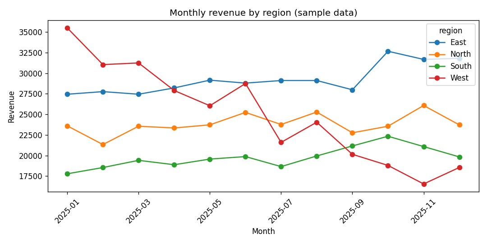

# DataPilot

An AI analyst for your spreadsheets. Upload a CSV, ask a question in plain
English, and it investigates the data step by step — writing and running real
pandas — then answers with a chart and a concrete recommendation.

Built to replace the hour a junior analyst spends poking at a file just to
answer one question.

## Why it's different

This isn't a chatbot that *talks about* your data. It's an agent that *works*
your data: it profiles the file, writes small pandas snippets, runs them,
reads the output, and decides whether it has enough to answer or needs another
step. Every number in the answer comes from code that actually ran — not from
the model guessing.

## Demo

Ask *"Which region is losing revenue over the year?"* against the included
sample data and the agent surfaces the West region's steady decline:



> Chart above is real output from the sample dataset. To capture a screenshot
> of the full app, run it with your API key and save the view to
> `docs/screenshot.png` — the README will pick it up.

## Stack

- **Agent loop:** OpenAI tool-calling
- **Analysis:** pandas + numpy, run in a restricted sandbox
- **Charts:** matplotlib (headless)
- **UI:** Streamlit

## Setup

```bash
python -m venv .venv
source .venv/bin/activate      # Windows: .venv\Scripts\activate
pip install -r requirements.txt
cp .env.example .env           # then add your OpenAI key
```

## Run

```bash
streamlit run app.py
```

Upload a CSV, type a question, watch it work.

## Try it with sample data

A sample sales dataset is included at `sample_data/sales.csv` (12 months × 4
regions). Good starter questions:

- *Which region is losing revenue over the year?*
- *What was total revenue in Q4?*
- *Which region has the highest average unit price?*

## Tests

Offline checks (no API key, no network) cover data profiling and the code
sandbox, including that file access is blocked:

```bash
PYTHONPATH=. python tests/test_offline.py
```

The full agent loop, which calls the model, has its own smoke test (needs
`OPENAI_API_KEY`):

```bash
PYTHONPATH=. python tests/test_agent_live.py
```

## How it works

1. On upload, the file is auto-profiled (shape, types, missing values, ranges)
   so the agent starts with context.
2. The agent answers by calling a `run_analysis` tool — short pandas snippets
   that run against the dataframe.
3. Snippets execute in a restricted sandbox: limited builtins, no file or
   network access, only the dataframe and pandas/numpy/matplotlib in scope.
4. Tool output is fed back to the agent, which loops until it can answer — then
   returns a plain-English summary, a chart, and a recommendation.

## Safety note

The agent runs model-generated code. The sandbox blocks file and network
access and restricts builtins, which is appropriate for a local analyst tool.
For a multi-tenant or hosted deployment, move execution into a proper isolated
container.

## Roadmap

- Support Excel and multiple sheets
- Export the analysis as a shareable report
- Remember prior questions within a session for follow-ups
- Anomaly detection and forecasting on time-series columns
